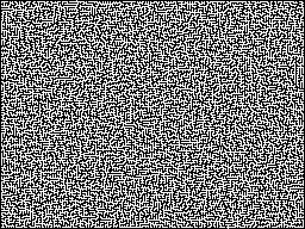

# MPath Benchmarks

This document outlines how to run benchmarks for the MPath pathfinding library.

## Standard Benchmarks

MPath includes benchmarks implemented with [BenchmarkDotNet](https://benchmarkdotnet.org/) for comparing performance against other popular pathfinding libraries.

### Complex Maze Pathfinding Results

The following benchmark was run on a complex maze to test pathfinding performance. The test involved finding a path from coordinates (10, 10) to (502, 374) through a maze with narrow passages and dead ends.

| Method    | Mean      | Allocated   |
|---------- |----------:|------------:|
| MPath     |  5.092 ms |    24.06 KB |
| [AStarLite](https://github.com/valantonini/AStar) |  8.118 ms |  8959.94 KB |
| [RoyTAStar](https://github.com/roy-t/AStar) | 59.028 ms | 12592.34 KB |
| [LinqToAStar](https://arc.net/l/quote/iqcsmlgc) | 5,532.7 ms | 108.13 MB |

<details>
<summary>Test Maze Image</summary>



*The complex maze used for benchmarking*
</details>

<details>
<summary>Specs</summary>

```
BenchmarkDotNet v0.14.0, macOS Sequoia 15.3.2 (24D81) [Darwin 24.3.0]
Apple M1 Max, 1 CPU, 10 logical and 10 physical cores
.NET SDK 7.0.100
  [Host]     : .NET 7.0.0 (7.0.22.61201), Arm64 RyuJIT AdvSIMD
  DefaultJob : .NET 7.0.0 (7.0.22.61201), Arm64 RyuJIT AdvSIMD
```
</details>

## Running Unity Benchmarks

The Unity project includes performance tests for comparing MPath against other popular pathfinding algorithms.

### Prerequisites

1. Make sure you have at least one maze data asset generated:
   - Select `Tools > Benchmarks > Generate Maze Data`
   - Select a maze image file (.gif, .png, or .jpg)
   - The tool will generate a MazeDataAsset in the `Assets/Bemcmarks/MazeData` directory

### Running Benchmarks in Unity Test Runner

1. Open the Unity Test Runner window (`Window > General > Test Runner`)
2. Select the "Editor" tab
3. Find the "Bemcmarks.Editor.PerformanceTests" test suite
4. Run individual tests or the entire test suite:
   - `MPathTest.RunBenchmark` - Test the MPath algorithm
   - `RoyTAStarTest.RunBenchmark` - Test the RoyT.AStar algorithm
   - `AStarLiteTest.RunBenchmark` - Test the AStar-Lite algorithm
   - `ComparisonTest.CompareAllAlgorithms` - Compare all three algorithms
5. Results are displayed in the Unity Console and saved to files

### Benchmark Results

Benchmark results are saved to the `[Application.persistentDataPath]/BemcmarkResults/` directory:
- Each algorithm has its own output file (e.g., `MPath.txt`)
- The comparison test outputs to `Comparison.txt`
- Results include execution time statistics and success rate

### Customizing Tests

If you want to modify the benchmark parameters:

1. Open the test files in `Assets/Bemcmarks/Editor/PerformanceTests/`
2. Adjust the start/end points in `BaseMazeTest.cs` or the specific test implementation
3. Modify the number of iterations in `BaseMazeTest.RunBenchmark()` or `ComparisonTest.cs`
4. Re-run the tests to see the updated results

### Adding Your Own Algorithm

To benchmark your own pathfinding algorithm:

1. Create a new test class that inherits from `BaseMazeTest`
2. Implement the required abstract methods:
   - `GetTestName()` - Return the name of your algorithm
   - `InitializePathfinder()` - Initialize your pathfinding algorithm
   - `FindPath(Vector2Int start, Vector2Int end)` - Run your pathfinding algorithm
3. Add your test to the `ComparisonTest` class if you want to include it in the comparison 