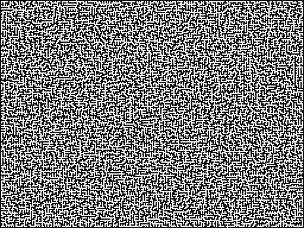

# MPath Benchmarks

This document contains detailed information about MPath's performance benchmarks and how to run them yourself.

## Complex Maze Pathfinding



*The complex maze used for benchmarking*

The following benchmark was run on a complex maze to test pathfinding performance. The test involved finding a path from coordinates (10, 10) to (502, 374) through a maze with narrow passages and dead ends. All benchmarks were implemented using [BenchmarkDotNet](https://benchmarkdotnet.org/).

### Implementation Comparison

| Method    | Mean      | Allocated   |
|---------- |----------:|------------:|
| MPath     |  5.092 ms |    24.06 KB |
| [AStarLite](https://github.com/valantonini/AStar) |  8.118 ms |  8.74 MB |
| [RoyTAStar](https://github.com/roy-t/AStar) | 59.028 ms | 12.29 MB |
| [LinqToAStar](https://arc.net/l/quote/iqcsmlgc) | 5,532.7 ms | 108.13 MB |

These results highlight MPath's optimization for both speed and memory efficiency. Memory allocation in MPath is required only for the initial pathfinder creation and for the final path result creation, with no GC pressure during the pathfinding algorithm execution.

### Path Smoothing Comparison

The following benchmark compares different path smoothing options using the same maze and coordinates:

| Method                 | Mean     | Allocated | Path Length |
|----------------------- |---------:|----------:|-----------:|
| NoSmoothing            | 5.066 ms | 24.06 KB  | 1078 |
| SimpleSmoothing        | 5.070 ms | 24.06 KB  | 311 |
| StringPullingSmoothing | 6.471 ms | 24.06 KB  | 200 |

The results show that:
- Simple smoothing adds negligible overhead compared to no smoothing
- String pulling smoothing adds about 28% overhead, but still maintains the same memory efficiency
- Path smoothing significantly reduces the number of steps in the path (SimpleSmoothing: 71% reduction, StringPullingSmoothing: 81% reduction)

## Benchmark Environment Specs

```
BenchmarkDotNet v0.14.0, macOS Sequoia 15.3.2 (24D81) [Darwin 24.3.0]
Apple M1 Max, 1 CPU, 10 logical and 10 physical cores
.NET SDK 7.0.100
  [Host]     : .NET 7.0.0 (7.0.22.61201), Arm64 RyuJIT AdvSIMD
  DefaultJob : .NET 7.0.0 (7.0.22.61201), Arm64 RyuJIT AdvSIMD
```

## Measurement Legend

```
Mean      : Arithmetic mean of all measurements
Error     : Half of 99.9% confidence interval
StdDev    : Standard deviation of all measurements
Ratio     : Mean of the ratio distribution ([Current]/[Baseline])
Allocated : Allocated memory per single operation (managed only, inclusive, 1KB = 1024B)
1 ms      : 1 Millisecond (0.001 sec)
```

## Running Benchmarks

### .NET Benchmarks

To run the benchmarks on your own machine:

1. Clone the repository
2. Navigate to the benchmark project folder:
   ```
   cd src/mpath-source/Migs.MPath.Benchmarks
   ```
3. Run the benchmarks:
   ```
   dotnet run -c Release
   ```

### Unity Benchmarks

Unity benchmark scenes are available in the Unity project:

1. Open the Unity project at `src/mpath-unity-project`
2. Open the benchmark scene at `Assets/MPath/Samples/Benchmarks`
3. Press play to run the benchmark scene
4. Results will be displayed in the Unity console 